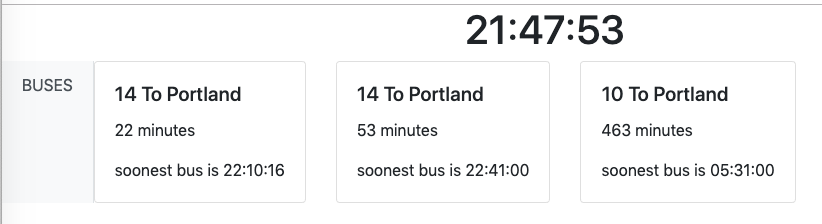

# housedisplay

A [re-frame](https://github.com/Day8/re-frame) application designed to display upcoming arrivals to Trimet stops.



## Development Mode

### Run application:

Edit resources/public/index.html to add a Trimet API key and comma-separated list of Trimet stops to watch. Then,

```
lein clean
lein figwheel dev
```

Figwheel will automatically push cljs changes to the browser.

Wait a bit, then browse to [http://localhost:3449](http://localhost:3449).

## Production Build


To compile clojurescript to javascript:

```
lein clean
lein cljsbuild once min
```

## Docker
A two-stage build compiles the application for production and then copies the compiled javascript into an nginx container to be served.
Use environment variables `API_KEY` and `STOPS_LIST` to provide your Trimet API key and comma-separated list of Trimet stops to watch.

The container is listening on port 80 but it isn't exposed; forward something to that so you can reach the application.
